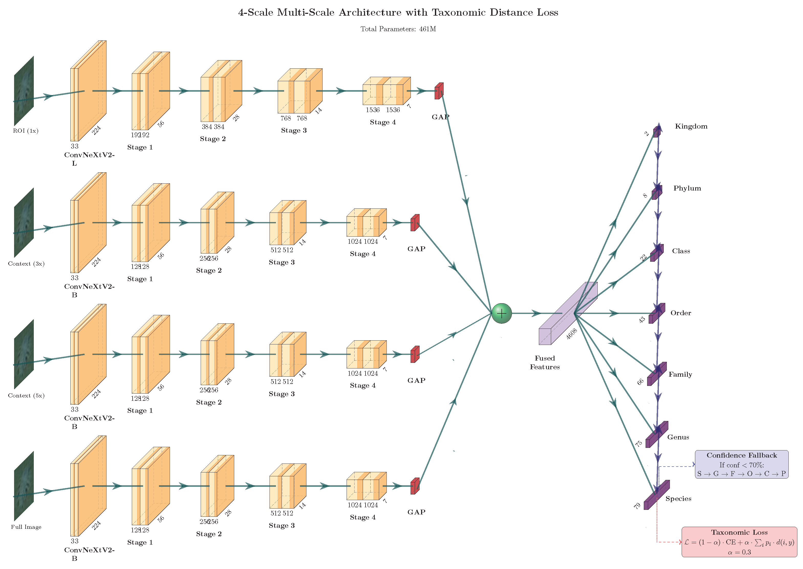

   


# Multi-Scale Context and Taxonomic Distance Learning for Marine Species Classification

**CAP6415 Computer Vision — Fall 2025 — University of Central Florida**

## Abstract

This report presents a comprehensive analysis of approaches to the FathomNet 2025 marine species classification competition at CVPR-FGVC. I describe the progression from adapting an 8th place Kaggle notebook solution to a modular Python training pipeline, enabling systematic experimentation with architectures and hyperparameters. I explore the winning solution's architecture, experiment with DINOv2 backbones, and develop multi-scale context models using ConvNeXtV2. My experiments demonstrate that adding full-image context (4-scale) combined with taxonomic distance-aware loss achieves our best performance (**private score 1.94**), representing a **27% improvement** over baseline approaches. I find that aligning training objectives with the evaluation metric provides greater benefit than architectural complexity.

---

## Architecture



Our best-performing model uses **asymmetric multi-scale context** with a **confidence-based taxonomic fallback**:

- **ROI Encoder**: ConvNeXtV2-Large (197M params) → 1536-d features
- **Context Encoders**: 3× ConvNeXtV2-Base (88M each) for 3×, 5×, and full-image scales → 1024-d each
- **Feature Fusion**: Concatenation → 4608-d fused representation
- **Hierarchical Heads**: 7 classification heads (Kingdom → Species)
- **Taxonomic Distance Loss**: $\mathcal{L} = (1-\alpha)\cdot\text{CE} + \alpha\cdot\sum_i p_i \cdot d(i,y)$ with $\alpha=0.3$
- **Inference Fallback**: If species confidence < 70%, fall back through taxonomy (S→G→F→O→C→P)

**Total Parameters**: 461M

**Result**: Private LB score of 1.94 (27% improvement over baseline)

---

## Competition Metric

The FathomNet 2025 competition uses **taxonomic distance** as the evaluation metric, which measures how far a prediction is from the ground truth in the biological taxonomy tree:

| Relationship | Distance |
|:-------------|:--------:|
| Same species | 0 |
| Same genus, different species | 1 |
| Same family, different genus | 2 |
| Same order, different family | 3 |
| Same class, different order | 4 |
| Same phylum, different class | 5 |
| Same kingdom, different phylum | 6 |
| Different kingdom | 7 |

**Lower scores are better.** This metric motivated our taxonomic distance-aware loss function, which directly optimizes for the evaluation criterion rather than standard cross-entropy.

---

## Key Findings

1. **Loss function alignment matters more than architecture**: Adding taxonomic distance to the loss (0.71 improvement) outperformed adding attention mechanisms or larger backbones.

2. **Multi-scale context helps at higher taxonomic ranks**: Environmental context (substrate, depth cues) disambiguates species that look similar in isolation but inhabit different habitats.

3. **Diminishing returns from additional scales**: 3× context provided the largest gain; 5× and full-image added smaller incremental improvements.

4. **Confidence-based fallback reduces catastrophic errors**: When the model is uncertain at species level, predicting at genus or family level incurs smaller penalties than guessing wrong species.

---

## Reproducing the Experiment

For full instructions including training commands, inference, and troubleshooting, see **[QUICKSTART.md](QUICKSTART.md)**.

To reproduce the results:
 
### 1. Clone the Repository
```bash
git clone https://github.com/<your-username>/CAP6415_F25_project-Kaggle-FathomNet.git
cd CAP6415_F25_project-Kaggle-FathomNet
```

### 2. Install Dependencies
Ensure you are using **Python ≥ 3.10** and have **CUDA-enabled GPUs** configured.

```bash
# Install as editable package (recommended)
pip install -e .

# Or install dependencies only
pip install -r requirements.txt
```

### 3. Configure Data Path
Open `hierarchical-classifier.ipynb` and edit the following line to point to your local dataset:
```python
DATA_ROOT = "/path/to/your/local/data"
```
Make sure the image files are actually present (and not Git LFS pointer text files). If you copied the dataset from a Git LFS repo, run `git lfs pull` in the dataset location before training or inference. The default CLI config expects data under `~/Documents/data/{train,test}/`.

### 4. Repository Structure

```
fathomnet/
├── config/                          # Experiment configurations
│   ├── experiment-default.yaml      # Base single-scale config
│   └── experiment-multiscale.yaml   # Multi-scale training config
├── data/                            # Data loading and preprocessing
│   ├── data.py                      # Main data loading utilities
│   ├── data_multiscale.py           # Multi-scale dataset classes
│   ├── preprocessing.py             # ROI extraction scripts
│   └── extract_multiscale_rois.py   # Multi-scale ROI extraction
├── src/                             # Source code (installable package)
│   ├── models/                      # Model architectures
│   │   ├── model.py                 # Base taxonomy classifier
│   │   ├── model_multiscale.py      # Multi-scale ConvNeXtV2 model
│   │   └── model_multiscale_taxloss.py  # Taxonomic distance-aware loss
│   ├── training/                    # Training scripts
│   │   ├── train_multiscale.py      # Main multi-scale training
│   │   └── train_multiscale_taxloss.py  # Taxonomic loss training
│   ├── inference/                   # Submission generation scripts
│   │   ├── generate_submission_taxloss.py
│   │   └── generate_submission_multiscale.py
│   ├── eval.py                      # Evaluation functions
│   └── losses.py                    # Custom loss functions
├── pyproject.toml                   # Package configuration
└── outputs/                         # Training outputs (checkpoints, logs)
```

### 5. Command-line Workflow

After installing with `pip install -e .`, you can use the CLI commands:

```bash
# Train multi-scale model with taxonomic loss (best performing)
fathomnet-train-taxloss \
    --config config/experiment-multiscale.yaml \
    --scales 1x 3x 5x full \
    --exp-name taxloss_4scales

# Train standard multi-scale model
fathomnet-train \
    --config config/experiment-multiscale.yaml \
    --scales 1x 3x 5x

# Generate submission
fathomnet-predict-taxloss \
    --checkpoint outputs/taxloss_4scales/checkpoints/best.ckpt \
    --output submission.csv
```

Or run the scripts directly:

```bash
python -m src.training.train_multiscale_taxloss --help
python -m src.inference.generate_submission_taxloss --help
```

Edit `config/experiment-multiscale.yaml` to customize dataset paths, augmentation strength, backbone selection, optimizer settings, and hierarchy-loss weights.

### 6. Notebook (Legacy)
The original `hierarchical-classifier.ipynb` still ships for interactive exploration, but the scripted workflow above is the preferred, reproducible path for experiments.

---

## Dependencies
All required packages are listed in `requirements.txt`.  
This includes:
- PyTorch  
- torchvision  
- pytorch-lightning  
- timm  
- scikit-learn  
- pandas, numpy, matplotlib, seaborn  

Make sure your PyTorch and torchvision builds are compatible with your CUDA version.

---

## Results Summary

| Model | Public LB | Private LB |
|:------|:---------:|:----------:|
| Baseline (ROI-only ConvNeXtV2-Base) | 2.77 | 2.65 |
| 3-scale multi-scale | 2.11 | 2.12 |
| 4-scale multi-scale | 2.18 | 2.05 |
| 3-scale + taxonomic loss | 2.27 | 2.00 |
| **4-scale + taxonomic loss** | 2.65 | **1.94** |
| 1st place solution (reference) | 1.65 | 1.44 |

**Best Result**: Private LB score of **1.94** (27% improvement over baseline)

| Metric | Value |
|:-------|:-----:|
| **Framework** | PyTorch Lightning |
| **ROI Backbone** | ConvNeXtV2-Large (197M) |
| **Context Backbones** | ConvNeXtV2-Base (88M × 3) |
| **Total Parameters** | 461M |

---

## References

[1] Kaggle, "FathomNet 2025 Competition," 2025. [Online]. Available: https://www.kaggle.com/competitions/fathomnet-2025

[2] K. Katija *et al.*, "FathomNet: A global image database for enabling artificial intelligence in the ocean," *Scientific Reports*, vol. 12, no. 15914, 2022. doi: 10.1038/s41598-022-19939-2

[3] 1st Place Solution, "FathomNet 2025 - 1st Place Solution," Kaggle Discussion, 2025. [Online]. Available: https://www.kaggle.com/competitions/fathomnet-2025/discussion/561618

[4] Z. Liu, H. Mao, C.-Y. Wu, C. Feichtenhofer, T. Darrell, and S. Xie, "A ConvNet for the 2020s," in *Proc. IEEE/CVF Conf. Comput. Vis. Pattern Recognit. (CVPR)*, 2022, pp. 11976–11986.

[5] S. Woo *et al.*, "ConvNeXt V2: Co-designing and Scaling ConvNets with Masked Autoencoders," in *Proc. IEEE/CVF Conf. Comput. Vis. Pattern Recognit. (CVPR)*, 2023, pp. 16133–16142.

[6] A. Vaswani *et al.*, "Attention is all you need," in *Proc. Adv. Neural Inf. Process. Syst. (NeurIPS)*, vol. 30, 2017, pp. 5998–6008.

[7] Paper Review AI, "AI-assisted feedback on research writing," 2025. [Online]. Available: https://www.paperreview.ai/

[8] Anthropic, "Claude," 2025. [Online]. Available: https://www.anthropic.com/claude. Repository organization and code refactoring assistance.

[9] GitHub, "GitHub Copilot," 2025. [Online]. Available: https://github.com/features/copilot. Git workflow and version control assistance.
